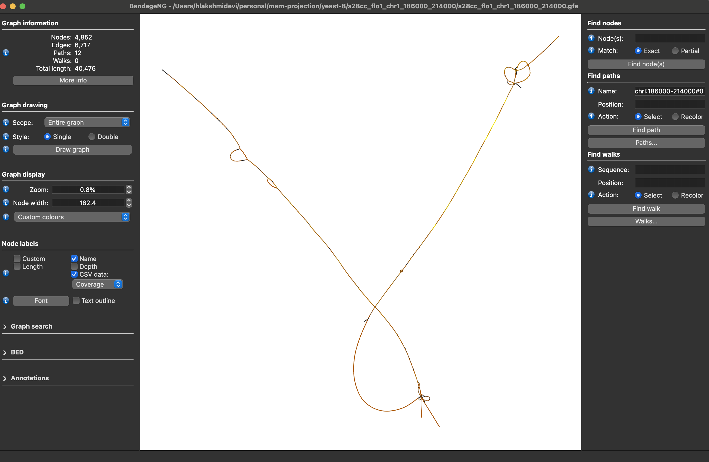
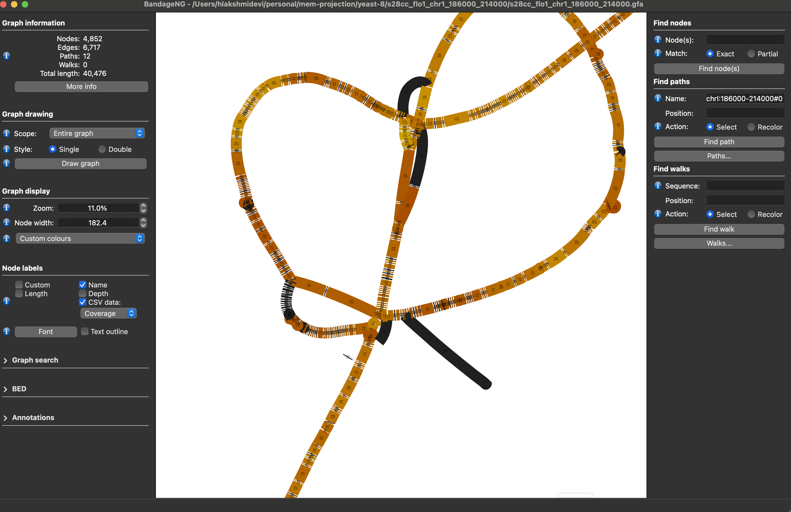

# MEM Projection

A BWT-based projection pipeline for mapping sequencing reads to pangenome graphs via maximal exact matches, enabling efficient graph-based read mapping and genotyping.

---

## Overview

This pipeline implements a BWT-based projection approach for mapping sequencing reads to pangenome graphs, designed to support downstream graph-based genotyping applications.

### The MEM-Projection Approach

The core methodology identifies **Maximal Exact Matches (MEMs)** between sequencing reads and the pangenome sequence using a full-text index optimized for MEM queries. These matches are then efficiently projected from the linear sequence space onto the graph structure through an auxiliary mapping that links index coordinates (text positions/intervals) to graph coordinates.

### Technical Implementation

The pipeline extends and integrates several core components:

- **r-index**: Full-text index based on the run-length encoded Burrows-Wheeler Transform (RLBWT) for efficient MEM finding
- **Tag-index**: Auxiliary mapping structure that connects BWT positions to graph coordinates
- **gafpack**: Custom parallel path-walker that computes paths and node coverage from match positions
- **PGGB pipeline**: For pangenome graph construction from multi-sample assemblies

### Workflow Summary

1. **Graph Construction**: Build pangenome graphs from reference and sample sequences
2. **Index Building**: Create RLBWT and r-index from lossless sequence space
3. **Tag Mapping**: Construct auxiliary structure linking BWT coordinates to graph positions
4. **MEM Finding**: Query reads against the r-index to identify maximal exact matches
5. **Graph Projection**: Map MEMs to graph coordinates using the tag index
6. **Coverage Computation**: Calculate path-specific and node-level coverage for genotyping

This BWT-to-graph projection strategy enables fast, scalable read mapping while maintaining the full complexity of pangenome variation for accurate genotyping.

---

## Dependencies

1. **pggb** - Pangenome Graph Builder (includes wfmash, seqwish, smoothxg, odgi, gfaffix, samtools)
2. **pangenome-index** - [Repository](https://github.com/hlakshmidevi10/pangenome-index-pvt) - Provides build_rindex, build_tags, compress_tags, find_mems
3. **gafpack** - [Repository](https://github.com/hlakshmidevi10/gafpack-pvt/tree/path-walker) - Path-walker and coverage computation
4. **impg** - Pangenome query tool for extracting regions of interest
5. **wgsim** - Read simulation tool
6. **vg** - Variation graph toolkit

---

## Environment Setup

### PATH Configuration

```bash
export PATH=$HOME/personal/wfmash/build/bin:$PATH
export PATH=$HOME/personal/pafcheck/target/release:$PATH
export PATH=$HOME/personal/seqwish/bin:$PATH
export PATH=$HOME/personal/GFAffix/target/release:$PATH
export PATH=$HOME/personal/odgi/bin:$PATH
export PATH=$HOME/personal/smoothxg/bin:$PATH
export PATH=$HOME/personal/gfainject/target/release:$PATH
export PATH=$HOME/personal/gafpack/target/release:$PATH
export PATH=$HOME/personal/pggb:$PATH
export PATH=$HOME/personal/ropebwt3:$PATH
export PATH=$HOME/personal/gbwtgraph/bin:$PATH
export PATH=$HOME/personal/grlBWT/build:$PATH
export PATH=$HOME/personal/minimap2/bin:$PATH
export PATH=$HOME/personal/pangenome-index-latest/bin:$PATH
export PATH=$HOME/personal/seqtk/bin:$PATH
export PATH=$HOME/personal/wgsim:$PATH
```

---

## Whole-Genome Analysis

### Build Pangenome Graph

```bash
samtools faidx reference/scerevisiae8.fa.gz
pggb -i reference/scerevisiae8.fa.gz -t 16 -o pggb.scerevisiae8
gfa2gbwt -c pggb.scerevisiae8/scerevisiae8.fa.gz.a65af12.11fba48.056cb79.smooth -p --pan-sn
mv pggb.scerevisiae8/scerevisiae8.fa.gz.a65af12.11fba48.056cb79.smooth.gbz .
```

### Verify Graph Statistics

View stats about the graph and the GBWT index (should show 8 samples / 8 haplotypes):

```bash
gbz_stats -i scerevisiae8.fa.gz.a65af12.11fba48.056cb79.smooth.gbz
gbz_stats -g scerevisiae8.fa.gz.a65af12.11fba48.056cb79.smooth.gbz
```

### Extract Sequences and Create RLBWT

```bash
gbz_extract -b -p scerevisiae8.fa.gz.a65af12.11fba48.056cb79.smooth.gbz > scerevisiae8.fa.gz.a65af12.11fba48.056cb79.smooth.seq
grlbwt-cli scerevisiae8.fa.gz.a65af12.11fba48.056cb79.smooth.seq
```

### Build Tag Index

```bash
build_rindex scerevisiae8.fa.gz.a65af12.11fba48.056cb79.smooth.rl_bwt > scerevisiae8.fa.gz.a65af12.11fba48.056cb79.smooth.ri
build_tags scerevisiae8.fa.gz.a65af12.11fba48.056cb79.smooth.gbz scerevisiae8.fa.gz.a65af12.11fba48.056cb79.smooth.rl_bwt scerevisiae8.fa.gz.a65af12.11fba48.056cb79.smooth.tags 31 2> build-tags-scerevisiae8.fa.gz.a65af12.11fba48.056cb79-31-01.out.log
compress_tags scerevisiae8.fa.gz.a65af12.11fba48.056cb79.smooth.ri scerevisiae8.fa.gz.a65af12.11fba48.056cb79.smooth.tags scerevisiae8.fa.gz.a65af12.11fba48.056cb79.smooth 2> compress-tags-scerevisiae8.fa.gz.a65af12.11fba48.056cb79.out.log
```

### Simulate Reads

Extract a region of interest and simulate reads (~10× single-end 200 bp reads with Q30-ish errors, no SNPs/indels beyond sequencing noise):

```bash
mkdir reads && cd reads
samtools faidx ../reference/scerevisiae8.fa.gz S288C#1#chrII:274000-284000 > S288C#1#chrII:274000-284000.fa
wgsim -N 500 -1 200 -2 200 -e 0.001 -r 0 -R 0 -X 0 -S 42 S288C\#1\#chrII:274000-284000.fa s288c_gla_chr2_274000_284000.fq /dev/null
awk 'NR % 4 == 2' s288c_gla_chr2_274000_284000.fq > s288c_gla_chr2_274000_284000_N500_R1_200_reads.txt
```

### Find MEMs

```bash
find_mems scerevisiae8.fa.gz.a65af12.11fba48.056cb79.smooth.ri scerevisiae8.fa.gz.a65af12.11fba48.056cb79.smooth_compressed.tags reads/s288c_gla_chr2_274000_284000_N500_R1_200_reads.txt 30 1 scerevisiae8_s288c_gla_chr2_274000_284000_N500_R1_200
```

### Prepare Graph Paths

```bash
vg convert -fW --no-translation scerevisiae8.fa.gz.a65af12.11fba48.056cb79.smooth.gbz > scerevisiae8.fa.gz.a65af12.11fba48.056cb79.smooth.gfa
path_extract scerevisiae8.fa.gz.a65af12.11fba48.056cb79.smooth.gbz scerevisiae8.paths
```

### Compute Coverage

```bash
./target/debug/gafpack --gfa $WDIR/scerevisiae8.fa.gz.a65af12.11fba48.056cb79.smooth.gfa --path-pos "${OUT_PREFIX}_path_pos.tsv" --seq-id-starts "${OUT_PREFIX}_seq_id_starts.out" --path-names $WDIR/scerevisiae8.paths --gaf-file-prefix $OUT_PREFIX --len-scale
```

### Validate GAF Output

```bash
~/personal/gafpack/validate_gaf.py scerevisiae8_s288c_gla_chr2_274000_284000_N500_R1_200.gaf reads/s288c_gla_chr2_274000_284000_N500_R1_200_reads.txt scerevisiae8.fa.gz.a65af12.11fba48.056cb79.smooth.gfa
```

---

## ROI (Region of Interest) Analysis

### Extract Region-Specific Sequences

```bash
impg query -a ../pggb.scerevisiae8/scerevisiae8.fa.gz.a65af12.alignments.wfmash.paf -r S288C#1#chrI:186000-214000 --sequence-files ../reference/scerevisiae8.fa.gz -o fasta -O s28cc_flo1_chr1_186000_214000 -v 2
samtools faidx s28cc_flo1_chr1_186000_214000.fa
```

### Build Region-Specific Graph

```bash
pggb -i s28cc_flo1_chr1_186000_214000.fa -o pggb.s28cc_flo1_chr1_186000_214000
gfa2gbwt -c pggb.s28cc_flo1_chr1_186000_214000/s28cc_flo1_chr1_186000_214000.fa.a65af12.11fba48.056cb79.smooth.final -p --pan-sn
mv pggb.s28cc_flo1_chr1_186000_214000/s28cc_flo1_chr1_186000_214000.fa.a65af12.11fba48.056cb79.smooth.final.gbz s28cc_flo1_chr1_186000_214000.gbz
```

### Extract Sequences and Create RLBWT

```bash
gbz_extract -b -p s28cc_flo1_chr1_186000_214000.gbz > s28cc_flo1_chr1_186000_214000.seq
grlbwt-cli s28cc_flo1_chr1_186000_214000.seq
```

### Build Tag Index

```bash
build_rindex s28cc_flo1_chr1_186000_214000.rl_bwt > s28cc_flo1_chr1_186000_214000.ri
build_tags s28cc_flo1_chr1_186000_214000.gbz s28cc_flo1_chr1_186000_214000.rl_bwt s28cc_flo1_chr1_186000_214000.tags 31 2> build-tags-s28cc_flo1_chr1_186000_214000.out.log
compress_tags s28cc_flo1_chr1_186000_214000.ri s28cc_flo1_chr1_186000_214000.tags s28cc_flo1_chr1_186000_214000 2> compress-tags-s28cc_flo1_chr1_186000_214000.out.log
```

### Prepare Graph Paths

```bash
vg convert -fW --no-translation s28cc_flo1_chr1_186000_214000.gbz > s28cc_flo1_chr1_186000_214000.gfa
path_extract s28cc_flo1_chr1_186000_214000.gbz s28cc_flo1_chr1_186000_214000.paths
```

### Simulate Reads

```bash
samtools faidx s28cc_flo1_chr1_186000_214000.fa S288C#1#chrI:186000-214000 > s28cc_chr1_186000_214000.fa
wgsim -N 500 -1 200 -2 200 -e 0.001 -r 0 -R 0 -X 0 -S 42 s28cc_flo1_chr1_186000_214000.fa s28cc_flo1_chr1_186000_214000.fq  /dev/null
awk 'NR % 4 == 2' s28cc_flo1_chr1_186000_214000.fq > s28cc_flo1_chr1_186000_214000_N500_R1_200_reads.txt
```

### Find MEMs and Compute Coverage

```bash
find_mems s28cc_flo1_chr1_186000_214000.ri s28cc_flo1_chr1_186000_214000_compressed.tags s28cc_flo1_chr1_186000_214000_N500_R1_200_reads.txt 30 1 s28cc_flo1_chr1_186000_214000_N500_R1_200
~/personal/gafpack/target/debug/gafpack --gfa s28cc_flo1_chr1_186000_214000.gfa --path-pos "${OUT_PREFIX}_path_pos.tsv" --seq-id-starts "${OUT_PREFIX}_seq_id_starts.out" --path-names s28cc_flo1_chr1_186000_214000.paths --gaf-file-prefix $OUT_PREFIX --len-scale
python3 ../../scripts/bandage_coverage.py s28cc_flo1_chr1_186000_214000_N500_R1_200_coverage.csv
```

---

## Visualization

### Coverage Plots

Full graph view with read coverage:



Region-specific coverage detail:

